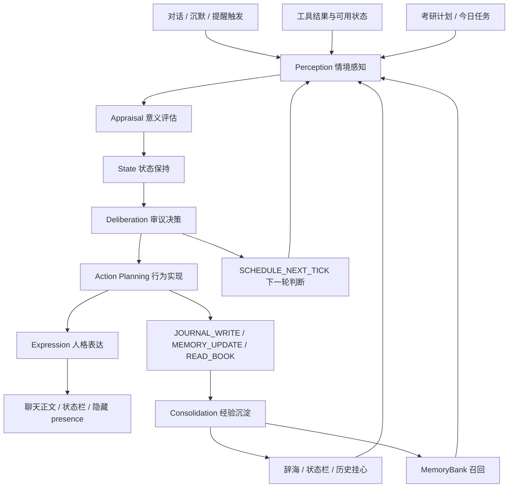

# 情境感知-意义评估-状态保持-审议决策-行为实现-人格表达-经验沉淀架构

## 结论

这套 7 层框架已经进入实现，并且在“后台小脑 / 主动消息 / 滚动判断”链路中最完整。它不是一个单独的 `SevenLayerSystem` 类，而是由提示词契约、结构化状态对象、主动服务、工具规划、状态栏表达、辞海与记忆银行共同组成。

当前实现可以概括为：

| 层级 | 实现状态 | 当前性质 |
| --- | --- | --- |
| 1. 情境感知 Perception | 已实现，主动链路较完整 | 收集时间、上下文、工具结果、工具可用状态、考研计划、召回记忆、状态栏/辞海/历史挂心记录 |
| 2. 意义评估 Appraisal | 已实现但部分依赖模型生成 | 有结构化字段 `MeaningAppraisal`，评估意义、价值、风险、成本、后果、资源 |
| 3. 状态保持 State | 部分完整 | 普通聊天有 `LuluState`，滚动判断有更完整的 belief / motive / emotion / cadence / history |
| 4. 审议决策 Deliberation | 已实现，主动链路核心 | `RollingJudgmentLoop` 与模型 planner 决定是否开口、查工具、等待、写辞海、安排下一轮 |
| 5. 行为实现 Action Planning | 已实现，仍有硬规则加强空间 | 有行动池、工具请求、主动工具执行、提醒规划；时间动作的 Temporal Grounding 主要是提示词规则 |
| 6. 人格表达 Expression | 已实现，普通聊天和状态栏链路可用 | 隐藏 `<lulu_presence>`、`set_lulu_expression_state`、表达 affordance 池共同承接 |
| 7. 经验沉淀 Consolidation | 已实现但不是每轮强制全量沉淀 | 辞海、日志、阅读、反思、情感记忆抽取、记忆银行写入与召回已接通 |

因此，答案不是“还没实现”，也不是“已经完全硬编码闭环”。准确说法是：

> 7 层框架已经作为系统契约和运行链路实现；主动/滚动判断链路最接近完整架构。普通聊天链路仍有部分层级停留在提示词注入、启发式状态更新或异步沉淀上，还没有统一成一个强类型、全路径必经的 7 层流水线。

## 总体运行链路

实际运行时，这套系统大致按下面顺序工作：

1. 聊天或后台触发产生新的观察需求。
2. 系统收集当前事实：对话、时间、工具状态、学习计划、最近状态、辞海/记忆召回。
3. 后台 planner 或滚动判断器将事实送入 7 层契约。
4. 模型或规则生成结构化判断：belief、traitMotive、situationalMotive、emotion、appraisal、action、nextEvaluateDelayMinutes、consolidation。
5. 主动服务根据判断选择行为：发消息、等待、查工具、写辞海、读材料、沉淀记忆、安排下一轮。
6. 表达层把已决定的行为转成人设化输出，并把状态栏描述写进隐藏状态块或本地状态文件。
7. 辞海和记忆银行把事件、情绪、关系判断和策略经验沉淀为后续可召回材料。

主要落点：

- `app/src/main/java/me/rerere/rikkahub/service/LivingJudgmentModelPlanner.kt`
- `app/src/main/java/me/rerere/rikkahub/service/RollingJudgmentLoop.kt`
- `app/src/main/java/me/rerere/rikkahub/service/LivingPresencePlanner.kt`
- `app/src/main/java/me/rerere/rikkahub/service/LuluIntentModelPlanner.kt`
- `app/src/main/java/me/rerere/rikkahub/data/service/ProactiveMessageService.kt`
- `app/src/main/java/me/rerere/rikkahub/data/model/LuluState.kt`
- `app/src/main/java/me/rerere/rikkahub/data/ai/transformers/LuluStateTransformer.kt`
- `app/src/main/java/me/rerere/rikkahub/data/ai/tools/LocalTools.kt`
- `app/src/main/java/me/rerere/rikkahub/data/cihai/CihaiModels.kt`
- `app/src/main/java/me/rerere/rikkahub/data/service/MemoryBankService.kt`
- `app/src/main/java/me/rerere/rikkahub/data/service/AffectiveMemoryExtractor.kt`

## 1. 情境感知 Perception

定义：情境感知层只收集和整理可观察事实，不负责解释意义，也不直接决定行动。

当前输入包括：

- 当前时间与沉默时长。
- 最近对话上下文。
- 工具结果与工具可用状态。
- 考研计划状态、今日学习任务和日程块。
- 排序后的向量记忆召回。
- 最近状态栏、辞海、历史挂心记录。
- 本地能力观察，例如电量、应用使用、位置、穿戴、日历、摄像头等可用工具。

运行表现：

- `ProactiveMessageService` 会在七层审议前构造 `LivingObservation`，把 requested tools、available tools、missing tools、tool observations、study tasks、battery 等压成 perception summary。
- `LivingObservationToolRunner` 负责把部分工具作为观察能力自动读取，失败或不可用也会作为 observation，而不是假装已经知道。
- `LuluIntentModelPlanner` 的后台小脑提示词明确把时间、上下文、考研计划、工具结果、工具状态、向量记忆、状态栏/辞海/历史记录列为感知事实。
- `LuluPerceptionCollector`、`LuluPresence`、`LuluState` 为普通聊天路径提供较轻量的感知摘要。

对外连接：

- 工具系统：通过本地工具、MCP 工具和主动工具观察进入感知层。
- 考研计划：通过学习任务和今日计划状态进入感知层。
- 记忆系统：`MemoryBankService.buildRecallContext()` 提供 `<lulu_memory>` 风格的召回上下文。
- 辞海/状态栏：最近记录被作为“历史挂心记录”和状态上下文提供给后续判断。

缺口：

- 主动链路有清晰 `LivingObservation`，但普通聊天链路还没有统一的强类型 `PerceptionSnapshot`。
- 感知事实与状态解释在部分普通聊天路径中仍可能混合，需要进一步把“事实材料”和“第一视角解释”分离。

## 2. 意义评估 Appraisal

定义：意义评估层判断“这件事意味着什么”，但不直接选择行动。它给后续判断提供权重。

当前评估维度包括：

- 重要性。
- 威胁与风险。
- 机会与价值。
- 身体安全。
- 精神安全。
- 时间压力。
- 行动成本。
- 可能收益。
- 不行动后果。
- 可用资源。

运行表现：

- `RollingJudgmentLoop` 定义 `MeaningAppraisal`，字段为 `meaning`、`value`、`risk`、`cost`、`consequence`、`resources`。
- `LivingJudgmentModelPlanner` 要求模型在 JSON 中输出 `appraisal`，并明确说明它接近 Lazarus appraisal theory：先评估事件意义，再评估资源是否足够。
- `RollingJudgmentLoop` 对健康安全、普通沉默、学习专注、DDL、起床等 intent kind 提供 fallback appraisal。
- `LivingPresencePlanner` 和 `ProactiveMessageService` 会把 appraisal 写进下一轮判断 reason 和目标化主动消息原因中。

对外连接：

- 工具结果进入 appraisal 后变成风险、资源、成本或机会。例如电量低是资源约束，起床时间是时间压力，学习任务未完成是任务风险。
- 记忆召回会影响 appraisal 的意义判断，例如用户习惯、边界、最近承诺、身体状态历史。
- 辞海沉淀会把多轮判断形成的 appraisal 经验变成下次可复用材料。

缺口：

- Appraisal 已有结构化字段，但普通聊天路径中不总是显式落入 `MeaningAppraisal`。
- 目前很大一部分意义评估由模型按提示词生成，缺少统一、可测试的 deterministic evaluator。

## 3. 状态保持 State

定义：状态保持层保存感知和评估之后形成的持续心理状态。它不是裁判，不重新决定“该不该做”，只保存当前理解、动机、情绪、意图和历史痕迹。

当前状态材料包括：

- `belief`：第一视角解释，不是原始感知。
- `traitMotive`：长期人设底层动机，例如依恋、保护欲、责任感、占有欲、学习监督职责。
- `situationalMotive`：本次情境为什么在意。
- `intention`：当前打算。
- `emotion`：自然语言情绪结构，含 `emotionLabel`、`feltSense`、`impulse`、`restraintText`、`intensity`。
- `nextEvaluateAt`、`evaluationCadence`、`lastJudgmentTrace`：由审议层产生，状态层保存。

运行表现：

- `RollingJudgmentLoop.LivingIntent` 保存 belief、desire/intention、hypotheses、emotion、candidateActions、lastObservation、lastJudgmentTrace、traitMotive、situationalMotive、appraisal、consolidation。
- `LuluState` 保存普通聊天侧的状态栏状态：`statusText`、`innerVoice`、mood、energy、relationship、mode、selfScene、perceptionSummary、reason。
- `ChatService` 和 `ChatVM` 会在对话后调用 `buildLuluStateFromTurn()` 生成状态快照，并写回 settings。
- `currentProjectedLuluState()` 会根据沉默时长投射状态，但只作为事实和状态变化，不替代审议决策。

对外连接：

- 状态栏：`LuluStateTransformer` 把当前状态注入 `<lulu_presence>`。
- 主动服务：`ProactiveMessageService` 读取 `currentProjectedLuluState()` 作为主动判断上下文。
- 记忆系统：状态中的未说出口、关系判断和情绪会被 `AffectiveMemoryExtractor` 抽取成长期记忆。

缺口：

- `LuluState` 是普通聊天状态模型，字段较轻；`LivingIntent` 是滚动判断状态模型，字段更完整。两者尚未统一成同一个状态核心。
- cadence 和 history 的职责已经按“审议产生、状态保存”实现，但普通聊天状态里还没有完整保存 7 层 trace。

## 4. 审议决策 Deliberation

定义：审议决策层综合前三层，回答现在是否行动、做什么、何时再判断、为什么不行动。ReAct 属于这里：边想、边查、边修正。

当前审议问题包括：

- 是否开口。
- 是否先查工具。
- 是否等待。
- 是否写辞海。
- 是否安排下一轮。
- 是否请求用户补充信息。
- 行动优先级是什么。
- 不行动的理由是什么。

运行表现：

- `RollingJudgmentLoop.evaluate()` 是滚动判断的核心执行点，会结合 observation、intent、model trace 或 fallback trace 更新 intent。
- `LivingJudgmentModelPlanner` 是后台结构化判断器，只输出 JSON，不生成聊天正文。
- `LuluIntentModelPlanner` 分为后台主动意图规划和聊天前行动规划：前者决定是否主动联系、多久后联系、优先看哪些工具；后者决定本轮回复前是否调用工具和安排后续主动消息。
- `ProactiveMessageService` 根据 rolling decision 决定生成消息、静默解决、写辞海、阅读、安排下一轮或 pass。

对外连接：

- 工具连接：审议层可以选择 `TOOL_USE`，由后续行为实现层具体执行。
- 记忆连接：审议时读取 memory recall，沉淀时反写辞海/记忆银行。
- 时间连接：审议层决定 `nextEvaluateDelayMinutes`，状态层保存下一轮时间。

缺口：

- ReAct 目前主要以提示词契约和服务流程体现，没有独立的 `ReActTrace` 强类型对象。
- 普通聊天路径中的审议比主动链路弱，更多依赖聊天前 planner 和工具请求，而不是完整 rolling judgment。

## 5. 行为实现 Action Planning

定义：行为实现层不再讨论“该不该做”，而是把已选行动变成可执行方案：用哪个工具、参数是什么、先后顺序是什么、失败怎么办、是否需要反馈给表达层。

当前行动池包括：

- `MESSAGE`
- `WAIT`
- `TOOL_USE`
- `SET_ALARM`
- `JOURNAL_WRITE`
- `MEMORY_UPDATE`
- `SCHEDULE_NEXT_TICK`
- `ASK_USER`
- `PASS`

运行表现：

- `LivingPresenceAction` 显式定义行动池。
- `LuluIntentModelPlanner` 的聊天前规划会输出 `toolRequests`、`followUpDelayMinutes`、`expressionGuidance`、`expressionAffordances`。
- `ProactiveToolPlanner`、`ProactiveReminderPlanner`、`ProactiveMessageService` 把工具候选、提醒、日志、阅读、记忆沉淀串起来。
- `LocalTools` 提供 `write_lulu_journal`、`set_lulu_expression_state` 等本地动作。
- `LivingPresencePlanner` 将 rolling intent 转成未来 reminder plan 和 action hints。

对外连接：

- 本地工具：写日记、写状态栏、查时间、电量、应用、位置等。
- 提醒系统：下一轮主动检查和滚动判断。
- 辞海系统：`JOURNAL_WRITE` 与 `MEMORY_UPDATE` 可落到 `CihaiService` 和 memory bank。
- 用户交互：`ASK_USER` 作为需要补充信息时的行为出口。

缺口：

- Temporal Grounding 已写入 `LivingJudgmentModelPlanner` 等提示词，要求涉及时钟动作必须先确认当前时间和目标时间；但它还不是所有时间类工具调用前的统一硬前置校验器。
- 工具失败后的恢复策略存在服务级处理，但还没有统一的 action execution trace。

## 6. 人格表达 Expression

定义：人格表达层只负责把已经决定的行动表达成人话或状态，不决定政策，不改变行动选择。

当前表达材料包括：

- 人设和语言风格。
- 当前情绪、精力、关系状态、行动状态。
- 表达偏好、称呼、语气。
- 状态栏文字、动作描写、内心独白、未说出口想法。
- 表达 affordance：文字、颜文字、表情包、语音、状态栏、轻提醒、长解释、静默记录。

运行表现：

- `LivingPresenceExpressionAffordance` 显式定义 `TEXT`、`KAOMOJI`、`STICKER`、`VOICE`、`STATUS_BAR`、`LIGHT_REMINDER`、`LONG_EXPLANATION`、`SILENT_RECORD`。
- `LuluStateTransformer` 在输入消息中注入 `<lulu_presence>`，要求回复末尾附带隐藏状态块：`status`、`description`、`inner_voice`、`thought`。
- `LuluExpressionOutputTransformer` 负责解析并隐藏输出中的 presence block，将表达状态转成 UI metadata。
- `LocalTools.set_lulu_expression_state` 会把状态栏描写、emoji、sticker、gesture、inner_voice、thought 写入 `lulu_expression_state.jsonl`。
- `ChatMessage` 会读取最新 expression snapshot，供聊天 UI 下方状态/心声面板使用。

对外连接：

- UI 状态栏：隐藏状态块和 `set_lulu_expression_state` 是表达层到 UI 的桥。
- 记忆系统：`inner_voice` 和 `thought` 可进入后续情感记忆抽取。
- 主动消息：`expressionGuidance` 和 affordances 指导最终消息用克制、撒娇、认真、短句、轻提醒等方式表达。

缺口：

- 表达 affordance 已进入 planner，但 UI 对 `STICKER`、`VOICE` 等 affordance 的实际渲染能力取决于具体前端/客户端支持。
- 表达层与行动层的边界主要由提示词约束维持，尚未完全通过类型系统禁止表达层越权改策略。

## 7. 经验沉淀 Consolidation

定义：经验沉淀层不是简单存档，而是把一次经历压缩成四类长期材料：情节、情感、知识、策略。

四类沉淀：

- `Episodic Trace`：这次发生了什么，我如何判断，我做了什么。
- `Affective Residue`：这件事留下了什么感觉和情绪惯性。
- `Semantic Memory`：可长期复用的用户偏好、作息、学习习惯、关系边界。
- `Policy Learning`：以后遇到类似情况如何做，例如普通沉默不要催太密、涉及时钟先查设备时间。

运行表现：

- `ConsolidationPlan` 结构化保存 `episodicTrace`、`affectiveResidue`、`semanticMemory`、`policyLearning`。
- `LivingJudgmentModelPlanner` 要求每次结构化判断输出 consolidation。
- `CihaiModels` 会把静默判断、行动日志、阅读笔记、反思转换为辞海条目。
- `write_lulu_journal` 写入私有 JSONL，同时通过 `CihaiService.addEntryAndRemember()` 进入辞海并发送到 memory bank。
- `CihaiEntry.toMemoryCandidate()` 把辞海条目转换为 `AffectiveMemoryCandidate`。
- `AffectiveMemoryExtractor` 从普通对话中抽取角色情绪、身体感受、未说出口想法、关系影响、用户信号等结构化记忆。
- `MemoryBankService` 负责保存、召回、重排、图谱扩展和 recall 计数更新。

对外连接：

- 辞海：保存内心日志、行动记录、阅读笔记、反思。
- 记忆银行：向量化、关键词召回、重要记忆召回、图谱关联、重排。
- 下一轮判断：召回结果回到感知层，成为下一次 appraisal 和 deliberation 的输入。

缺口：

- 沉淀层已接入，但不是每一轮普通聊天都强制产出完整四分类 consolidation。
- policy learning 主要来自模型生成、辞海反思和抽取器，不是统一的可测试规则学习模块。
- 记忆写入存在异步和筛选策略；这有助于避免噪音，但也意味着“每次经历必沉淀”并不成立。

## 外部系统连接图

## 当前最完整链路

最完整的是主动/后台链路：

1. `LuluIntentModelPlanner` 先做后台小脑规划。
2. `ProactiveMessageService` 构造 perception observation。
3. `RollingJudgmentLoop` 保存和更新 living intent。
4. `LivingJudgmentModelPlanner` 生成结构化 7 层 trace。
5. `ProactiveMessageService` 执行消息、等待、工具、辞海、阅读、记忆沉淀、下一轮 tick。
6. `LuluStateTransformer` 和 `set_lulu_expression_state` 把表达状态送到 UI。
7. `CihaiService`、`AffectiveMemoryExtractor`、`MemoryBankService` 把结果变成长期记忆。

## 当前较弱链路

较弱的是普通聊天全路径：

- 普通聊天已经有状态注入、表达状态块、状态快照、情感记忆抽取。
- 但普通聊天并不总是经过完整的 `LivingObservation -> MeaningAppraisal -> LivingIntent -> LivingJudgmentTrace -> ConsolidationPlan` 强类型链路。
- 因此普通聊天更像“轻量 7 层上下文 + 状态/记忆抽取”，而不是“每轮必经完整 7 层审议流水线”。

## 后续加固方向

如果要把 7 层从“已实现的系统契约和主要链路”升级为“全路径硬架构”，建议按优先级处理：

1. 定义统一 `SevenLayerTrace` 或 `LivingPresenceTrace`，包含 perception、appraisal、state、deliberation、actionPlan、expressionPlan、consolidation。
2. 让普通聊天和主动消息都产出同一类 trace，只是触发频率和字段完整度不同。
3. 把 Temporal Grounding 从提示词规则提升为时间类工具调用前的统一硬校验。
4. 把表达层 affordance 与 UI 能力做显式 capability mapping，避免 planner 选择 UI 尚未支持的表达方式。
5. 给 consolidation 增加可测试策略：哪些对话必须写入辞海，哪些只进入短期状态，哪些进入长期记忆银行。
6. 为 appraisal 增加少量 deterministic guardrail，例如身体安全、DDL、闹钟、学习计划等高优先级场景的最低风险判断。

## 最终判定

这套框架已经搭起来，并且已经和外部工具、状态栏、辞海、记忆银行、考研计划、主动提醒系统发生真实连接。

它当前的成熟度可以分三层：

- 架构契约：完整。
- 主动/滚动判断链路：基本完整。
- 普通聊天全路径强类型闭环：部分完成，仍需统一 trace、硬化时间规则、加强沉淀策略。

所以，对“7 个循环在框架里面都已经实现了吗”的严格回答是：

> 七层都已经有实现落点；其中感知、审议、行为、表达、沉淀的外部连接已经真实接通。意义评估和状态保持也有结构化实现，但在普通聊天路径中仍有一部分依赖提示词和启发式状态更新。整体已经不是概念稿，而是运行中的分布式架构；下一步要做的是把它收束成全路径统一 trace 和更硬的执行约束。
