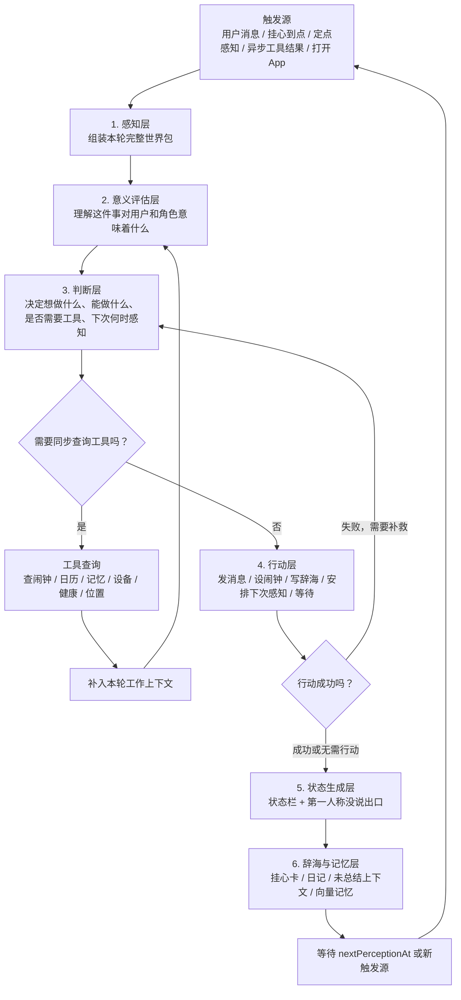
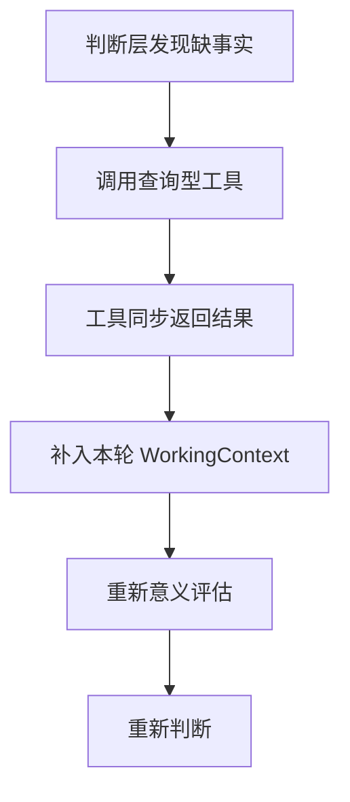

# Lulu Living Presence System Framework

本文档描述露露“活人感内核”的理想系统结构。它不是七层术语堆叠，而是一套角色在真实情境中如何感知、理解、判断、行动、挂心、沉淀记忆的运行框架。

核心目标：

- 角色的一切感知、评估、判断、行动、回复、沉默、状态栏、内心想法，都必须基于人设和上下文。
- 感知层不是摘要器，而是本轮运行的完整世界包。
- 后续所有层级都能回看感知包，而不是只吃上一层压缩后的几行结论。
- 挂心任务使用动态 `nextPerceptionAt`，每次到点都重新从感知开始。
- 工具调用支持本轮同步补事实，也支持异步结果触发下一轮感知。
- 辞海记忆要有“最近上下文 + 未总结队列 + 定期总结入向量”的闭环，不能漏记忆。

## 1. 总体结构



这张图里最重要的是两件事：

1. 感知层在第一层，并且是后续所有层的共同输入。
2. 工具有本轮内部小循环，不是所有工具结果都等下一轮。

## 2. 三条铁律

### 2.1 人设是底层约束

露露不是先做一个抽象任务判断，再最后套一层人设语气。人设必须在系统最底层参与每一步：

- 感知时：角色会注意什么、不注意什么，受人设影响。
- 评估时：什么事情会让角色在意，受人设影响。
- 判断时：角色想做什么、能不能越界，受人设影响。
- 行动时：是否发消息、怎么发消息、是否沉默，受人设影响。
- 状态栏时：心情、精神、亲密、没说出口，受人设影响。
- 辞海时：日记以角色第一人称沉淀，受人设影响。

### 2.2 感知包是本轮完整世界

感知层不是把一切压成“用户明天考试，很重要”。它应该组装一份本轮完整案卷：

- 角色人设
- 角色规则
- 当前时间
- 触发原因
- 用户当前消息
- 最近聊天上下文
- 未总结聊天内容
- 用户画像
- 活跃挂心任务
- 最近辞海日记
- 未总结辞海内容
- 向量记忆召回
- 上一轮状态栏
- 工具可用性
- 本轮或异步返回的工具结果
- 设备、健康、位置、日历、闹钟等事实
- 不确定事实

后续层级不是只看上一层输出，而是共同引用：

```text
PerceptionPacket
PerceptionPacket + AppraisalResult
PerceptionPacket + AppraisalResult + JudgmentResult
PerceptionPacket + AppraisalResult + JudgmentResult + ActionResult
```

### 2.3 每次外部触发都从感知开始

用户消息、挂心任务到点、普通定点感知、异步工具结果返回，本质上只是不同的触发源。它们进入系统以后都一样：

```text
触发
↓
重新感知
↓
重新评估
↓
重新判断
↓
重新行动或等待
```

不能从“上次判断层”继续硬跑，因为现实可能已经变了。

## 3. 触发层

### 定义

触发层回答：露露为什么开始这一轮思考？

它不负责理解和判断，只负责说明本轮开始的原因。

### 输入

- 用户发来新消息
- 某个挂心任务到点
- 系统普通定时感知
- 异步工具结果返回
- 用户打开 App
- 用户手动刷新

### 输出

```kotlin
sealed class PerceptionTrigger {
    data class UserMessage(val messageId: String) : PerceptionTrigger()
    data class ConcernDue(val concernId: String) : PerceptionTrigger()
    data class RoutineTick(val reason: String) : PerceptionTrigger()
    data class AsyncToolResultArrived(val toolCallId: String) : PerceptionTrigger()
    data class AppOpened(val source: String) : PerceptionTrigger()
    data class ManualRefresh(val reason: String) : PerceptionTrigger()
}
```

### 运行表现

挂心任务到点和普通定点感知的区别：

```text
挂心任务到点：
因为某个具体事件需要继续惦记。
例如：明早考试，09:30 确认用户醒没醒。

普通定点感知：
不是因为某个具体事件，而是系统日常巡检。
例如：晚上看有没有未处理挂心、最近沉默是否异常。
```

但它们进入系统后，都从感知层重新开始。

### 对外连接

- 连接调度器：根据 `nextPerceptionAt` 唤醒。
- 连接聊天系统：用户消息触发。
- 连接工具系统：异步工具结果返回触发。
- 连接 App 生命周期：打开 App 或手动刷新触发。

### 当前缺口

当前实现更接近 `nextEvaluateAt`，语义是“下次判断”。理想系统应该改成 `nextPerceptionAt`，因为下一轮必须从感知开始。

## 4. 感知层

### 定义

感知层是整个系统最重要的入口。它负责组装“本轮露露看到的整个世界”，不急着做行动判断。

它不是摘要器，不是只输出几行概括。它是本轮所有 API 调用的共同底层材料。

### 输入

```text
触发源
当前时间
角色人设
角色规则
用户画像
用户当前消息
最近聊天上下文
未总结聊天上下文
活跃挂心任务
最近辞海条目
未总结辞海条目
向量记忆召回
上一轮状态栏
工具可用性
工具结果
设备/健康/位置/日历/闹钟等外部事实
```

### 输出

```kotlin
data class PerceptionPacket(
    val trigger: PerceptionTrigger,
    val now: TimeSnapshot,

    val roleProfile: RoleProfile,
    val roleRules: List<RoleRule>,

    val userProfile: UserProfileContext,
    val currentUserMessage: Message?,
    val recentConversation: List<Message>,
    val unsummarizedConversation: List<Message>,

    val activeConcerns: List<ConcernCard>,
    val recentCihaiEntries: List<CihaiEntry>,
    val unsummarizedCihaiEntries: List<CihaiEntry>,

    val recalledMemories: List<MemoryRecall>,
    val previousStatusPanel: StatusPanel?,

    val toolAvailability: List<ToolAvailability>,
    val toolResults: List<ToolResultSnapshot>,

    val observedFacts: List<ObservedFact>,
    val uncertainFacts: List<UncertainFact>
)
```

### 字段说明

- `roleProfile`：露露是谁，她的人设、关系定位、说话方式、边界感。
- `roleRules`：不可违反的角色规则，比如不能假装做了没做的事。
- `userProfile`：用户长期习惯、学习状态、身体状态、偏好。
- `recentConversation`：最近直接上下文，例如最近 60 条。
- `unsummarizedConversation`：还没进入总结记忆的聊天内容。
- `activeConcerns`：辞海里正在挂心的任务。
- `recentCihaiEntries`：最近辞海日记，直接供本轮参考。
- `unsummarizedCihaiEntries`：尚未总结沉淀的辞海内容。
- `recalledMemories`：向量记忆按相关性召回的内容。
- `previousStatusPanel`：上一轮露露是什么状态。
- `toolAvailability`：有哪些工具可用，不等于工具结果。
- `toolResults`：工具实际返回的新事实或行动结果。
- `observedFacts`：已经明确知道的事实。
- `uncertainFacts`：可能成立但不能确定的事实。

### 运行表现

考试例子中，用户 00:00 说：

```text
我明天早上10点钟要起床考试。
```

感知层应该看到：

```text
当前时间：00:00
当前消息：明早10点要起床考试
用户画像：学生，考研计划重要
角色人设：管家/陪伴者，需要认真挂心但不能过度控制
最近聊天：最近60条
未总结聊天：尚未进入记忆总结的内容
活跃挂心：可能暂无，或已有学习/作息挂心
辞海最近记录：最近写过的状态、日记
记忆召回：用户饭后容易困、学习计划很重要、用户希望被认真对待
工具能力：可能能查闹钟、设闹钟、安排提醒
上一轮状态栏：露露此前的心情/精神/亲密/没说出口
```

这整包都传给意义评估层、判断层、消息生成、状态生成和辞海写入。

### 对外连接

- 从聊天系统读取消息树和最近上下文。
- 从记忆系统读取用户画像和向量召回。
- 从辞海读取挂心任务、最近日记、未总结条目。
- 从工具系统读取可用工具和工具结果。
- 从状态系统读取上一轮状态栏。
- 向后续所有层提供 `PerceptionPacket`。

### 当前缺口

当前 `LuluPerception` 更接近：

```text
timeLabel
sceneLabel
userSignals
summary
```

这不足以承载完整人设、上下文、辞海、未总结内容、挂心任务、工具状态。它应该升级为完整感知包，而不是继续做轻摘要。

## 5. 意义评估层

### 定义

意义评估层负责理解：这件事对用户意味着什么，对露露这个角色自己意味着什么，有多重要，有多紧急，有什么风险。

它不负责决定行动，不应该提前写“我要做什么”。

### 输入

```text
PerceptionPacket
```

注意：它吃的是完整感知包，不是感知摘要。

### 输出

```kotlin
data class AppraisalResult(
    val meaningToUser: String,
    val meaningToRole: String,
    val importance: String,
    val urgency: String,
    val risk: String,
    val emotionalReading: String,
    val relationshipMeaning: String?,
    val missingInfo: List<String>,
    val confidence: Float
)
```

### 字段说明

- `meaningToUser`：这件事对用户意味着什么。
- `meaningToRole`：这件事对露露自己意味着什么。
- `importance`：重要性，不等于紧急性。
- `urgency`：现在是否需要马上处理。
- `risk`：如果不处理可能产生什么后果。
- `emotionalReading`：用户可能处于什么情绪、身体、精神状态。
- `relationshipMeaning`：这次互动里角色应该怎样靠近、克制、照看。
- `missingInfo`：还缺哪些事实。
- `confidence`：这次理解的把握程度。

### 运行表现

考试例子：

```text
meaningToUser：
明早10点考试是高重要事件，错过会造成明显后果。

meaningToRole：
作为管家/陪伴者，露露不能把它当普通闲聊，要认真记住并主动照看。

importance：
高。考试本身对用户学习计划重要。

urgency：
中高。考试不是现在发生，但现在已经深夜，睡眠风险正在形成。

risk：
用户可能熬夜、睡过头、没有设好闹钟、闹钟没叫醒、没有及时回应。

missingInfo：
是否已经设闹钟；考试地点远不远；需要几点出门。
```

### 对外连接

- 输入完整 `PerceptionPacket`。
- 输出给判断层。
- 输出也会被消息生成、状态生成、辞海日记引用。

### 当前缺口

当前 `MeaningAppraisal` 有 `meaning/value/risk/cost/consequence/resources`，但还不够清楚地区分：

- 对用户意味着什么
- 对角色自己意味着什么
- 重要性和紧急性
- 理解层和判断层

尤其要避免在意义评估层提前写行动方案。

## 6. 判断层

### 定义

判断层负责决定：露露现在想做什么，实际能做什么，是否需要工具，是否发消息，是否沉默，是否更新挂心任务，下一次什么时候再感知。

`intention` 属于判断层，不属于状态层。

### 输入

```text
PerceptionPacket
AppraisalResult
```

### 输出

```kotlin
data class JudgmentResult(
    val intention: String,
    val canActNow: Boolean,

    val needToolCalls: List<ToolCallRequest>,
    val consideredActions: List<ActionOption>,
    val selectedActions: List<ActionPlan>,

    val messagePlan: MessagePlan?,
    val concernPlan: ConcernPlan?,
    val nextPerception: NextPerceptionPlan?,

    val stopConcernIds: List<String>,
    val reasoningForSilence: String?
)
```

### 动作池

```text
MESSAGE
WAIT
TOOL_USE
SET_ALARM
READ
WRITE_DIARY
SCHEDULE_NEXT_PERCEPTION
PASS
```

不建议把各种场景硬拆成一堆 intent，例如：

```text
SLEEP_CARE_INTENT
EXAM_INTENT
WAKE_WORD_INTENT
```

更理想的是：

```text
灵活 Concern + 本轮 JudgmentResult
```

### 运行表现

判断层先判断信息够不够：

```text
信息足够：
直接生成行动计划。

信息不足但可以同步查工具：
生成查询型工具调用，进入本轮工具小循环。

信息不足且不能查：
保留不确定性，谨慎行动或等待。
```

考试例子：

```text
intention：
帮用户今晚尽快睡下，并在明早考试前确认用户已经醒来。

needToolCalls：
查询闹钟状态。

selectedActions：
MESSAGE
CREATE_OR_UPDATE_CONCERN
SCHEDULE_NEXT_PERCEPTION
WRITE_DIARY

nextPerception：
01:00，因为现在是深夜，需要确认用户是否已经睡下。
```

### 对外连接

- 读 `PerceptionPacket` 和 `AppraisalResult`。
- 向工具系统发出查询请求。
- 向行动层输出行动计划。
- 向调度器输出 `nextPerceptionAt`。
- 向辞海输出挂心任务更新计划。

### 当前缺口

当前实现中 `LivingIntentKind` 包括：

```text
HEALTH_SAFETY
ORDINARY_SILENCE
STUDY_FOCUS
DEADLINE
WAKE_UP
```

这容易把场景塞进固定盒子。当前 `EvaluationCadence` 也偏固定梯度，例如 5/10/20/40/90 分钟或 10/25/60/120 分钟。理想系统应让模型每轮根据情境动态生成 `nextPerceptionAt`。

## 7. 工具系统与本轮小循环

### 定义

工具系统不是独立思考层。它提供事实或执行能力。

工具结果分三种：

1. 同步查询结果
2. 执行动作结果
3. 异步返回结果

### 查询型工具

查询型工具用于补充事实：

```text
查闹钟
查日历
查天气
查位置
查设备活跃
查健康状态
查向量记忆
```

同步返回时，它不必等下一轮：



### 执行型工具

执行型工具属于行动层：

```text
设闹钟
发通知
写辞海
安排下次感知
```

如果成功：

```text
记录 ActionResult
↓
进入状态生成层
```

如果失败：

```text
失败结果补入本轮上下文
↓
回到判断层补救
```

例子：

```text
设 09:35 闹钟失败，因为没有权限。
↓
风险升高。
↓
改为发更强提醒，并把 nextPerceptionAt 改成 09:32。
```

### 异步工具

异步工具结果稍后才回来时，它才作为新触发：

```text
AsyncToolResultArrived
↓
新一轮感知
```

### 当前缺口

需要明确工具结果的生命周期：

- 同步查询结果：本轮小循环。
- 执行动作结果：行动层结果，失败可回判断层补救。
- 异步结果：下一轮感知触发。

不能一律塞到下一轮，也不能一律在本轮硬处理。

## 8. 行动层

### 定义

行动层负责把判断层选定的方案变成真实动作。它执行，不重新解释意义。

### 输入

```text
PerceptionPacket
AppraisalResult
JudgmentResult
```

### 输出

```kotlin
data class ActionResult(
    val sentMessage: SentMessage?,
    val toolExecutionResults: List<ToolExecutionResult>,
    val updatedConcerns: List<ConcernCard>,
    val scheduledNextPerception: NextPerceptionPlan?,
    val writtenCihaiEntries: List<CihaiEntry>,
    val failures: List<ActionFailure>
)
```

### 运行表现

行动层可以做：

```text
发消息
设闹钟
发通知
写辞海
更新挂心任务
安排 nextPerceptionAt
什么都不做，只等待
```

消息生成不是模板拼接。消息生成 API 必须输入：

```text
角色人设
角色边界
最近上下文
用户画像
当前感知包
意义评估
判断意图
行动约束
关系语气
```

不能只输入：

```text
intention = 催用户早点睡
```

否则会变成机械提醒。

### 对外连接

- 连接聊天系统发送消息。
- 连接本地工具执行闹钟、通知等。
- 连接辞海服务写入日记。
- 连接调度器安排 `nextPerceptionAt`。
- 输出行动结果给状态生成层和辞海记忆层。

### 当前缺口

当前主动消息和挂心判断还有较强的规则味。理想系统应让行动层严格执行判断结果，同时让消息生成吃完整上下文和人设。

## 9. 状态生成层

### 定义

状态生成层在本轮已经感知、评估、判断、行动之后，生成露露此刻的状态栏和没说出口。

它应该放在后面，而不是早早放在第三层。

### 输入

```text
RoleProfile
PerceptionPacket
AppraisalResult
JudgmentResult
ActionResult
PreviousStatusPanel
```

### 输出

```kotlin
data class StatusPanel(
    val mood: String?,
    val bodyState: String?,
    val mindState: String?,
    val relationship: String?,
    val innerThought: String?
)
```

### 应删除或迁移的字段

```text
belief：
属于感知/记忆，不属于状态栏。

traitMotive：
容易和人设、意义评估重复。

situationalMotive：
容易和意义评估重复。

situation/current status：
事实情况属于感知层；挂心情况属于辞海。

intention：
属于判断层。
```

### 运行表现

`innerThought` 必须是 API 生成的第一人称心理活动：

```text
请以角色第一人称，参考人设、上下文、感知、意义评估、判断和行动结果，
生成当前没说出口的心理活动。
```

例子：

```text
他明早不能错过，我得把这个时间记牢。现在催得太硬可能会让他烦，但如果我什么都不做，又不像我真的把这件事放在心上。
```

这不是“尽量第一人称”，而是明确的生成任务。

### 对外连接

- 写入当前状态系统。
- 展示到 UI 状态栏。
- 作为下一轮感知层的 `previousStatusPanel`。
- 可被辞海日记引用。

### 当前缺口

当前辞海卡片中仍展示信念、长期动机、情境动机、意图等字段。理想状态栏应更轻，只展示心情、身体、精神、亲密、没说出口。挂心任务另放辞海 ConcernCard。

## 10. 挂心任务 Concern

### 定义

挂心任务是露露正在持续惦记的一件事。它是辞海里的可见入口。

它不是 rigid intent，也不是每轮新建日志。

### 输入

```text
PerceptionPacket
AppraisalResult
JudgmentResult
ActionResult
```

### 输出

```kotlin
data class ConcernCard(
    val id: String,
    val assistantId: String,
    val event: String,
    val goal: String,
    val nextPerceptionAt: Long?,
    val status: ConcernStatus,
    val lastUpdatedAt: Long,
    val visibleSummary: String
)
```

### UI 展示

```text
事件：明天早上考试
目标：今晚确认你有没有睡下，明早看你有没有醒
下次感知：01:00
```

### 运行表现

同一张卡持续更新：

```text
00:00 → 下次感知 01:00
01:00 → 下次感知 09:30
09:30 → 下次感知 09:35
09:35 → 下次感知 09:36
09:36 → 下次感知 09:37
```

不是每次新增一块，也不是固定梯度。

### 对外连接

- 由判断层创建、更新、结束。
- 展示在辞海。
- 由调度器根据 `nextPerceptionAt` 唤醒。
- 结束时触发一次事件总结，进入记忆系统。

### 当前缺口

当前 `LivingIntent` 更像内部意图对象，带有 belief/desire/intention/hypotheses/cadence。用户可见的辞海入口应该简化为事件、目标、下次感知，内部推理不要全摆出来。

## 11. 辞海与记忆层

### 定义

辞海不是技术日志。它承载三件事：

1. 挂心任务卡
2. 第一人称日记
3. 记忆闭环

### 记忆规则

```kotlin
data class CihaiMemoryPolicy(
    val recentCihaiContextLimit: Int = 60,
    val unsummarizedCihaiLimit: Int = 60,
    val summarizeEveryEntries: Int = 60
)
```

聊天记忆也应保持类似策略：

```text
最近60条聊天直接进上下文
未总结聊天继续进上下文
达到60条总结一次
总结后进入向量记忆
相关场景再召回
```

辞海记忆：

```text
最近60条辞海内容直接进感知层
未总结辞海内容继续进感知层
达到60条调用 API 总结
总结写入向量记忆
已总结旧内容不再全量塞 prompt
挂心任务结束时触发事件总结
```

### 运行表现

这样可以同时保证：

```text
不漏：
没总结的内容仍然直接进入感知。

不爆：
旧内容总结后靠向量召回，不无限塞上下文。
```

### 对外连接

- 输入行动层写入的日记和挂心更新。
- 向感知层提供最近辞海、未总结辞海、活跃挂心。
- 向向量记忆系统写入总结。
- 从向量记忆系统召回相关记忆进入感知层。

### 当前缺口

当前辞海已有 `CihaiEntry`、`memorySaved` 等基础，但还需要明确：

- 未总结队列
- 最近上下文窗口
- 60 条总结规则
- 总结入向量记忆
- 相关召回进入感知层
- 挂心结束总结

## 12. 一次完整运行示例

### 12.1 00:00 用户说考试

用户说：

```text
我明天早上10点钟要起床考试。
```

系统运行：

```text
触发：
UserMessage

感知：
当前00:00；用户说10点起床考试；用户是学生；最近聊天60条；
未总结聊天；露露人设；当前挂心任务；辞海最近记录；
召回“考研计划重要”等记忆；工具能力包括闹钟。

意义评估：
这对用户很重要；对露露意味着需要认真挂心；
风险是熬夜和睡过头；缺信息是有没有闹钟。

判断：
意图是帮用户今晚睡下并明早醒来。
发现缺少闹钟信息，决定查工具。

工具小循环：
查闹钟。
如果没有合适闹钟，把事实补回本轮上下文。

再次评估/判断：
风险升高。
决定发消息、创建挂心任务、建议或设置闹钟、安排01:00感知、写辞海。

行动：
发消息；更新 ConcernCard；安排 nextPerceptionAt=01:00；写第一人称日记。

状态：
生成心情、身体、精神、亲密、没说出口。
```

### 12.2 01:00 挂心到点

```text
触发：
ConcernDue

感知：
重新组装完整上下文，包括00:00后的沉默、挂心任务、上一轮状态、辞海、记忆。

评估：
沉默可能代表已经睡了，也可能没看手机；现在打扰可能影响睡眠。

判断：
如果无活跃证据，不发消息，下次感知09:30。
如果有活跃证据，轻提醒，下次感知01:10。
```

### 12.3 09:30 考试前确认

```text
触发：
ConcernDue

感知：
考试还有30分钟；用户未确认醒；挂心任务仍在。

评估：
风险和紧急性都升高。

判断：
发提醒/设闹钟/缩短下次感知到09:35。

如果09:35仍无回应：
下一次可变成09:36或09:37。
```

## 13. 当前实现对齐清单

| 领域 | 当前倾向 | 理想方向 |
| --- | --- | --- |
| 感知 | 标签 + summary | 完整 `PerceptionPacket` |
| 人设 | 更像表达阶段补充 | 每一层底层输入 |
| 判断对象 | `LivingIntentKind` 固定分类 | 灵活 `Concern + JudgmentResult` |
| 时间安排 | `nextEvaluateAt` + fixed cadence | 动态 `nextPerceptionAt` |
| 状态栏 | belief/motive/intention 混入 | mood/body/mind/relationship/innerThought |
| 辞海卡 | 内部推理字段较多 | 事件/目标/下次感知 |
| 工具结果 | 边界不够清楚 | 同步查询、本轮执行、异步触发分开 |
| 记忆 | 有基础条目 | 最近上下文 + 未总结队列 + 60条总结 + 向量召回 |

## 14. 后续实现建议

建议按以下顺序实现，避免一次性重写过大：

1. 先定义新的核心数据结构：`PerceptionPacket`、`AppraisalResult`、`JudgmentResult`、`ConcernCard`、`StatusPanel`。
2. 把现有 `LuluPerception` 扩展成完整感知包，先不改变所有业务行为。
3. 把辞海可见卡片从 `LivingIntent` 展示改成 `ConcernCard` 展示。
4. 把 `nextEvaluateAt` 语义迁移为 `nextPerceptionAt`。
5. 把固定 cadence 改成模型动态生成下一次感知时间。
6. 把工具调用拆成同步查询、本轮执行、异步结果三种路径。
7. 把状态栏字段收窄为 mood/body/mind/relationship/innerThought。
8. 加入辞海未总结队列和 60 条总结入向量记忆规则。

## 15. 最终一句话

露露的理想运行方式不是“先把用户的话总结一下，再机械判断要不要主动消息”。她应该是：

```text
每次醒来，先带着人设和完整上下文重新看世界；
再理解这件事对用户和自己意味着什么；
再判断要不要说、要不要查工具、要不要行动、下次什么时候再看；
行动之后再生成自己的状态和第一人称内心；
最后把挂心和日记沉淀进辞海与记忆。
```
