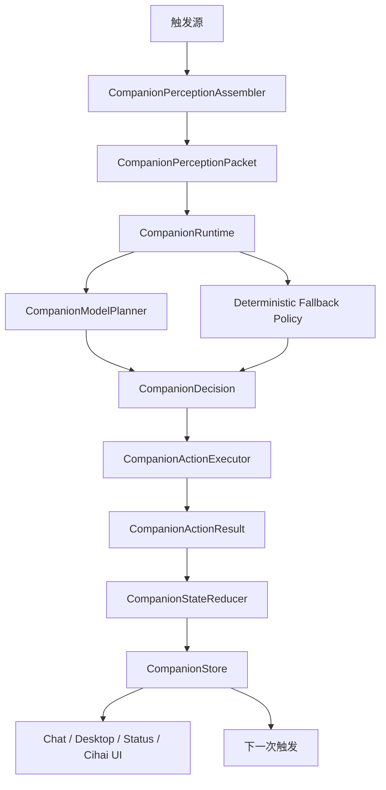

# Unified Companion Runtime Design

## 1. 目标

为 Lulu 建立一套角色无关、连续、可迁移的拟人化陪伴内核。任何 Assistant 都可以继续使用自己的系统人设、语言风格、关系定位和边界；运行时统一负责感知、关系、挂心、承诺、行动、状态和记忆生命周期。

第一阶段优先解决以下问题：

- 普通聊天与主动消息使用不同判断链路。
- `LuluState`、`LuluThought`、`LuluIntentPlan`、`LivingIntent`、辞海和向量记忆互相重叠。
- 关系状态展示存在，但不会随共同经历真正变化。
- 挂心只按类型合并，可能串角色或合并无关事件。
- 新一轮聊天可能清空之前已经安排的主动承诺。
- 辞海模板内容过早进入长期记忆，形成自我回声。
- 设计文档要求完整感知包，实际模型输入仍是若干摘要和固定分类。

## 2. 非目标

第一阶段不包含：

- 3D 角色、Live2D 或大型视觉重做。
- 完整实时双工语音和声学情绪识别。
- 更换现有 AI Provider 抽象层。
- 强制所有角色使用恋人、朋友或管家关系。
- 让模型无限制读取设备数据或绕过现有权限。
- 一次性删除所有旧数据字段，导致已有状态和记忆无法读取。

## 3. 核心原则

### 3.1 角色无关

底层数据结构不使用“露露式”“恋人式”“管家式”行为分类。角色身份来自 `Assistant` 的人设、规则和用户对该角色的关系配置。

运行时可以知道：

- 角色是谁。
- 角色与用户是什么关系。
- 角色有哪些边界和职责。
- 当前发生了什么。
- 过去有哪些共同经历和未完成承诺。

运行时不能预设：

- 所有角色都会撒娇。
- 沉默一定代表想念。
- 亲密一定随消息数量上升。
- 管家、恋人和朋友使用同一种主动表达方式。

### 3.2 单一事实源

同一个角色在同一时刻只保留一份有效的：

- 当前具身状态。
- 关系状态。
- 活跃挂心。
- 未完成承诺。
- 下一次感知计划。
- 待沉淀记忆队列。

提示词可以读取这些状态，但不能另外创建一套无法回写的数据模型。

### 3.3 感知和行动分离

“发现用户很晚还在使用手机”是观察事实；“要不要提醒”是判断；“发送消息”是行动。三者不能混在同一个关键词规则里。

### 3.4 承诺优先于随机主动

用户明确要求的提醒、角色明确说出的后续行动和高风险挂心必须拥有独立生命周期。普通聊天不能清空它们，随机主动消息也不能覆盖它们。

### 3.5 关系由事件改变

关系不是聊天次数，也不是模型随手输出的“很亲密”。关系变化必须对应可解释事件，例如：

- 用户主动分享重要经历。
- 角色兑现或错过承诺。
- 用户表达边界或修正偏好。
- 双方发生冲突、道歉或修复。
- 用户长期接受或拒绝某种主动方式。

## 4. 总体架构



触发源包括：

- 用户消息。
- 语音通话回合。
- 承诺到点。
- 挂心到点。
- 普通自主脉冲。
- App 打开或手动刷新。
- 异步工具结果。

所有触发源进入同一个运行时。普通聊天和主动消息不再各自维护一套内心、关系和计划。

## 5. 核心数据结构

### 5.1 CompanionTrigger

```kotlin
sealed interface CompanionTrigger {
    data class UserMessage(val conversationId: String, val messageId: String) : CompanionTrigger
    data class VoiceTurn(val conversationId: String, val sessionId: String) : CompanionTrigger
    data class ConcernDue(val concernId: String) : CompanionTrigger
    data class CommitmentDue(val commitmentId: String) : CompanionTrigger
    data class RoutinePulse(val reason: String) : CompanionTrigger
    data class AppOpened(val source: String) : CompanionTrigger
    data class ToolResultArrived(val actionId: String) : CompanionTrigger
}
```

### 5.2 CompanionPerceptionPacket

感知包是本轮所有判断的共同输入，不是单行摘要。

```kotlin
data class CompanionPerceptionPacket(
    val trigger: CompanionTrigger,
    val assistantId: String,
    val role: CompanionRoleContext,
    val now: CompanionTimeContext,
    val userProfile: CompanionUserContext,
    val recentConversation: List<CompanionMessageSnapshot>,
    val currentState: CompanionState,
    val relationship: CompanionRelationshipState,
    val activeConcerns: List<CompanionConcern>,
    val activeCommitments: List<CompanionCommitment>,
    val recalledMemories: List<CompanionMemorySnapshot>,
    val recentCihaiEntries: List<CompanionJournalSnapshot>,
    val sharedActivityFacts: List<CompanionObservedFact>,
    val toolAvailability: List<CompanionToolAvailability>,
    val toolResults: List<CompanionToolResult>,
    val uncertainFacts: List<CompanionUncertainFact>,
)
```

`sharedActivityFacts` 用于承接考研、星愿馆、游戏、健康等模块产生的共同经历。业务模块只发布事实，不直接修改亲密度或生成陪伴话术。

### 5.3 CompanionRelationshipState

关系状态按 `assistantId` 隔离，不固定为某一种关系身份。

```kotlin
data class CompanionRelationshipState(
    val assistantId: String,
    val familiarity: Float,
    val trust: Float,
    val closeness: Float,
    val reliability: Float,
    val boundaryConfidence: Float,
    val unresolvedTension: Float,
    val lastMeaningfulInteractionAt: Long?,
    val updatedAt: Long,
)
```

这些值只用于内部连续性和判断，不直接作为“游戏好感度”展示。角色如何解释这些状态由人设决定。

关系变化通过事件账本完成：

```kotlin
data class CompanionRelationshipEvent(
    val id: String,
    val assistantId: String,
    val sourceId: String,
    val kind: CompanionRelationshipEventKind,
    val trustDelta: Float = 0f,
    val closenessDelta: Float = 0f,
    val reliabilityDelta: Float = 0f,
    val boundaryDelta: Float = 0f,
    val tensionDelta: Float = 0f,
    val evidence: String,
    val createdAt: Long,
)
```

同一个 `sourceId + kind` 只能应用一次，避免流式生成、重试或双重调度重复增加关系值。

### 5.4 CompanionConcern

挂心表示角色持续关注的一件事，不等于承诺。

```kotlin
data class CompanionConcern(
    val id: String,
    val assistantId: String,
    val subjectKey: String,
    val event: String,
    val goal: String,
    val status: CompanionConcernStatus,
    val importance: Int,
    val nextPerceptionAt: Long?,
    val sourceMessageIds: List<String>,
    val lastUpdatedAt: Long,
)
```

合并键必须至少包含 `assistantId + subjectKey`。`subjectKey` 来自稳定事件身份，例如考试日期、任务 ID、闹钟目标或经过规范化的事件摘要。不能只按 `STUDY_FOCUS`、`DEADLINE` 等宽泛种类合并。

### 5.5 CompanionCommitment

承诺表示用户或角色明确约定的未来动作。

```kotlin
data class CompanionCommitment(
    val id: String,
    val assistantId: String,
    val subjectKey: String,
    val promise: String,
    val dueAt: Long,
    val status: CompanionCommitmentStatus,
    val sourceConversationId: String?,
    val sourceMessageId: String?,
    val actionPlan: CompanionActionPlan,
    val createdAt: Long,
    val resolvedAt: Long? = null,
)
```

生命周期为：

```text
PROPOSED -> ACTIVE -> DUE -> EXECUTING -> FULFILLED
                                     -> FAILED -> RETRY_SCHEDULED
          -> CANCELLED
          -> SUPERSEDED
```

新聊天只能：

- 创建新承诺。
- 明确取消已有承诺。
- 用相同 `subjectKey` 更新或替代已有承诺。

禁止无条件清空全部目标队列。

### 5.6 CompanionState

```kotlin
data class CompanionState(
    val assistantId: String,
    val statusText: String,
    val innerThought: String,
    val mood: String,
    val bodyState: String,
    val mindState: String,
    val activityMode: String,
    val selfScene: String,
    val updatedAt: Long,
    val sinceAt: Long,
)
```

底层不再使用固定 `LuluMood`、`LuluRelationship` 标签决定角色表达。结构化模型判断可以给出角色自己的状态文本，确定性 fallback 只负责安全默认值和状态连续性。

### 5.7 CompanionDecision

```kotlin
data class CompanionDecision(
    val intention: String,
    val actions: List<CompanionActionPlan>,
    val stateUpdate: CompanionStateUpdate,
    val relationshipEvents: List<CompanionRelationshipEvent>,
    val concernChanges: List<CompanionConcernChange>,
    val commitmentChanges: List<CompanionCommitmentChange>,
    val memoryCandidates: List<CompanionMemoryCandidate>,
    val nextPerceptionAt: Long?,
    val reasonForSilence: String?,
)
```

模型输出计划，执行器执行动作，Reducer 根据真实执行结果更新状态。模型不能声称未成功执行的承诺已经完成。

## 6. 运行流程

### 6.1 普通聊天

```text
用户消息
-> 组装完整感知包
-> 统一运行时判断本轮工具、表达、挂心、承诺和关系事件
-> 执行同步查询工具
-> 将结果补回感知包，必要时重新判断
-> 生成角色回复
-> 执行动作并记录真实结果
-> 更新状态、关系、挂心、承诺和记忆候选
```

### 6.2 主动触发

```text
到点触发
-> 根据 concernId 或 commitmentId 读取目标
-> 重新组装完整感知包
-> 判断现在是否仍需行动
-> 可发送、执行工具、改期、沉默或取消
-> 更新同一个事件生命周期
```

到点不等于必须发送消息。沉默也必须产生明确的下一状态，不能生成一条通用“我先等着”的长期记忆。

### 6.3 多个同时到期事件

调度器读取所有到期事项，按以下顺序处理：

1. 安全相关承诺或挂心。
2. 用户明确要求的承诺。
3. 有截止时间的任务。
4. 普通挂心。
5. 自主脉冲。

同一轮可以把相关事项合并进一个感知包，但不能只处理列表中的第一个后忽略其他到期事项。

## 7. 记忆策略

记忆分为四层：

1. 最近对话窗口：直接提供原始上下文。
2. 活跃挂心与承诺：结构化保存，不依赖向量召回。
3. 待沉淀队列：收集共同事件、偏好、关系变化和角色心声候选。
4. 长期记忆：经过批量总结、去重和证据检查后写入向量库。

以下内容不能直接进入长期记忆：

- 固定 fallback 心声。
- 每次沉默生成的通用惦记模板。
- 工具 JSON。
- 对架构和字段的复述。
- 没有新事实的辞海反思。
- 仅由系统自己生成、没有用户行为或执行结果支撑的关系变化。

长期记忆候选必须至少满足一项：

- 新的稳定用户事实或偏好。
- 明确承诺及其结果。
- 有证据的关系变化。
- 高情绪重量的共同事件。
- 用户主动纠正的旧记忆。
- 对未来互动有明确价值的边界信息。

辞海仍然保留角色第一人称书写体验，但“辞海可见内容”和“长期记忆写入”分成两个动作。

## 8. 模型与确定性逻辑边界

模型负责：

- 结合人设理解事件对用户和角色的意义。
- 生成角色特有的意图、内心和表达方向。
- 提议关系事件、挂心、承诺和下一次感知。
- 在多个合理动作之间做情境判断。

确定性代码负责：

- 数据隔离和唯一键。
- 时间解析后的校验。
- 调度、去重、重试和状态机。
- 关系增量范围限制和幂等。
- 工具权限及真实执行结果。
- 旧数据迁移。
- 防止普通聊天无条件清空承诺。

模型不可直接修改持久化对象。所有模型建议必须经过校验和 Reducer。

## 9. 错误处理

- 模型计划失败：使用最小确定性 fallback，不生成模板化亲密关系变化。
- 工具失败：保留失败结果，承诺进入 `FAILED` 或 `RETRY_SCHEDULED`，不能假装完成。
- 时间不明确：建立挂心或向用户确认，不创建错误的精确承诺。
- 后台调度延迟：到点后重新判断当前事实，不发送过期话术。
- 记忆模型失败：保留待沉淀队列，后续重试，不直接标记已保存。
- 旧数据解码失败：记录迁移日志并保留原始数据，不静默覆盖为空。

## 10. 隐私与边界

- 工具可用不代表每轮都要读取。
- 位置、通知、短信、摄像头和健康数据继续遵守用户权限与现有工具审批。
- 主动读取必须服务当前挂心、承诺或明确情境，不为展示能力而读取。
- 后续 UI 需要提供安静时间、主动程度、敏感主题和可读取数据范围，但不在第一阶段实现完整设置页。

## 11. 迁移策略

### 阶段 A：建立新内核和兼容适配器

- 新增角色无关数据结构和纯 Kotlin Reducer。
- 增加旧 `LuluState`、`LuluThought`、`LivingIntent` 到新结构的只读迁移适配器。
- 旧字段继续可解码，但新代码不再产生新的旧结构数据。

### 阶段 B：迁移普通聊天

- `ChatService` 通过 `CompanionRuntime` 获取感知、工具计划、状态、关系、挂心和承诺变更。
- 保留现有生成与 Transformer 管线，先替换状态来源和后续计划来源。
- 移除发送消息时的全量目标队列清理。

### 阶段 C：迁移主动消息

- `ProactiveMessageService` 使用同一个 `CompanionRuntime`。
- 调度从全局 SharedPreferences 单队列迁移为按角色和事件持久化的到期事项。
- AlarmManager/WorkManager 只负责唤醒，不承担业务真相。

### 阶段 D：迁移记忆和辞海

- 辞海写入与长期记忆写入解耦。
- 启用待沉淀队列和批量总结策略。
- 旧记忆继续召回，但增加来源和质量过滤。

### 阶段 E：删除旧代码

只有在生产调用全部迁移后删除：

- `LuluIntentPlanner` 及其重复固定分类。
- `LivingBeliefStore` 按宽泛 kind 合并的旧逻辑。
- 旧主动消息目标队列覆盖逻辑。
- 只用于模板化状态的固定心声生成分支。
- 不再被读取的兼容字段、旧 action 别名和死代码。

每次删除前先用 `rg` 确认没有生产引用。序列化兼容字段可以比业务实现保留更久。

## 12. 第一阶段验收标准

- 两个不同 Assistant 的挂心、关系和承诺完全隔离。
- 同一 Assistant 的两个不同截止任务不会合并。
- 用户继续聊天不会清空之前的明确承诺。
- 普通聊天和主动触发读取同一份关系与状态。
- 关系状态可以因有证据的事件上升、下降和修复。
- 失败的工具动作不会被记为已兑现。
- 辞海心迹不会逐条自动进入长期向量记忆。
- 新代码不再创建旧 `LuluIntentPlan` 或旧宽泛 `LivingIntent`。
- 已有用户数据可以迁移或继续读取。
- 核心代码不写死露露、恋人、朋友或管家行为。

## 13. 验证策略

开发机器只执行轻量验证：

- 纯 Kotlin 数据结构和 Reducer 的定向测试，能运行时执行。
- `rg` 引用检查。
- `git diff --check`。
- 资源和序列化字段静态检查。
- 条件允许时执行 `compileDebugKotlin`，超时则记录实际结果。

实际设备体验由项目所有者验证，重点场景为：

- 管家型露露连续三天陪伴和兑现提醒。
- 新建另一个完全不同人设的角色，确认不会继承露露表达。
- 同时建立两个提醒，再继续普通聊天，确认提醒仍存在。
- 用户拒绝一次主动联系后，后续主动程度是否合理下降。
- 角色错过承诺后是否承认、补救并影响可靠度。
- 辞海和记忆是否减少通用模板重复。

## 14. 后续阶段

统一内核稳定后再进行：

1. 陪伴主页：展示角色当下状态、共同事项、挂心和自然入口。
2. 主动边界设置：安静时间、主动程度、主题边界、稍后和勿扰。
3. 实时语音：流式 ASR、可打断 TTS、动态停顿和角色化哄睡。
4. 视觉具身化：头像状态、动作、共享场景和关系纪念物。

这些后续体验都消费统一内核状态，不再各自维护另一套角色状态。
